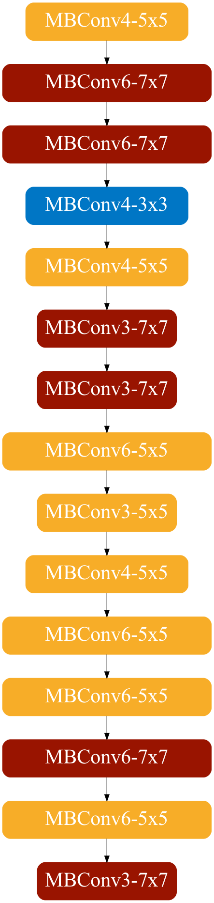

To setup, first install necessary dependencies

`pip install -r requirements.txt`


## Example: archi viualization 

```python
arch_str = "ks:5,7,7,3,5,7,0,0,7,5,5,0,5,5,0,0,5,7,5,7-ex:4,6,6,4,4,3,0,0,3,6,3,0,4,6,0,0,6,6,6,3-d:4,2,3,2,4"
ks_list, ex_list, d_list = ArchTool.deserialize(arch_str)
draw_arch(ks_list, ex_list)
```

The complete example can be found in [draw.py](draw.py). 

<p align="center">
  
</p>
